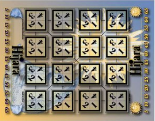

# Hijara



Desarrollo del juego Hikara programacion funcionall 2019

Para ejecutar el juego, moverse a la carpeta src, ejecutar haskell y cargar el archivo Hijara.hs

Luego de esto ya es posible ejecutar los comandos.

Ejemplo a continuacion.
```bash
16:14 $ cd ruta/del/proyecto/src
16:15 $ ghci
GHCi, version 8.0.2: http://www.haskell.org/ghc/  :? for help
Prelude> :l Hijara.hs
[1 of 6] Compiling HijaraTypes      ( HijaraTypes.hs, interpreted )
[2 of 6] Compiling Conversion       ( Conversion.hs, interpreted )
[3 of 6] Compiling AuxFuncScoreHijara ( AuxFuncScoreHijara.hs, interpreted )
[4 of 6] Compiling PrettyPrint      ( PrettyPrint.hs, interpreted )
[5 of 6] Compiling Game             ( Game.hs, interpreted )
[6 of 6] Compiling Hijara           ( Hijara.hs, interpreted )
Ok, modules loaded: AuxFuncScoreHijara, Conversion, Game, Hijara, HijaraTypes, PrettyPrint.
# ========================================================================
# Para jugarlo en la consola
# ========================================================================
*Hijara> runOnConsole
xxxxxxxxxxxxxxxxxxxxxxxxxxxxxxxxxxxxxxxxxxxxxxxxxxxxxxxxxxxxxxxx
Select one move: NewAction 1 1 1 NewAction 1 2 1 NewAction 1 3 1 NewAction 1 4 1 NewAction 2 1 1 NewAction 2 2 1 NewAction 2 3 1 NewAction 2 4 1 NewAction 3 1 1 NewAction 3 2 1 NewAction 3 3 1 NewAction 3 4 1 NewAction 4 1 1 NewAction 4 2 1 NewAction 4 3 1 NewAction 4 4 1
3 3 1
xxxxxxxxxxxxxxxxxxxxxxxxxxxxxxxxxxxxbxxxxxxxxxxxxxxxxxxxxxxxxxxx
Select one move: NewAction 1 1 1 NewAction 1 2 1 NewAction 1 3 1 NewAction 1 4 1 NewAction 2 1 1 NewAction 2 2 1 NewAction 2 3 1 NewAction 2 4 1 NewAction 3 1 1 NewAction 3 2 1 NewAction 3 3 2 NewAction 3 4 1 NewAction 4 1 1 NewAction 4 2 1 NewAction 4 3 1 NewAction 4 4 1
3 3 2
xxxxxxxxxxxxxxxxxxxxxxxxxxxxxxxxxxxxbyxxxxxxxxxxxxxxxxxxxxxxxxxx
Select one move: NewAction 1 1 1 NewAction 1 2 1 NewAction 1 3 1 NewAction 1 4 1 NewAction 2 1 1 NewAction 2 2 1 NewAction 2 3 1 NewAction 2 4 1 NewAction 3 1 1 NewAction 3 2 1 NewAction 3 3 3 NewAction 3 4 1 NewAction 4 1 1 NewAction 4 2 1 NewAction 4 3 1 NewAction 4 4 1
3 4 1
xxxxxxxxxxxxxxxxxxxxxxxxxxxxxxxxxxxxbybxxxxxxxxxxxxxxxxxxxxxxxxx
Select one move: NewAction 1 1 1 NewAction 1 2 1 NewAction 1 3 1 NewAction 1 4 1 NewAction 2 1 1 NewAction 2 2 1 NewAction 2 3 1 NewAction 2 4 1 NewAction 3 1 1 NewAction 3 2 1 NewAction 3 3 3 NewAction 3 4 2 NewAction 4 1 1 NewAction 4 2 1 NewAction 4 3 1 NewAction 4 4 1
2 2 1
xxxxxxxxxxxxxxxxxxyxxxxxxxxxxxxxxxxxbybxxxxxxxxxxxxxxxxxxxxxxxxx
Select one move: NewAction 1 1 1 NewAction 1 2 1 NewAction 1 3 1 NewAction 1 4 1 NewAction 2 1 1 NewAction 2 2 2 NewAction 2 3 1 NewAction 2 4 1 NewAction 3 1 1 NewAction 3 2 1 NewAction 3 3 3 NewAction 3 4 2 NewAction 4 1 1 NewAction 4 2 1 NewAction 4 3 1 NewAction 4 4 1
# ========================================================================
# Para que se juegue automatico
# ========================================================================
*Hijara> juego=beginning
*Hijara> run
runMatch      runOnConsole
*Hijara> runMatch (randomAgent BluePlayer , randomAgent YellowPlayer ) juego
xxxxxxxxxxxxxxxxxxxxxxxxxxxxxxxxxxxxxxxxxxxxxxxxxxxxxxxxxxxxxxxx
xxxxxxxxxxxxxxxxxxxxxxxxxxxxxxxxxxxxxxxxxxxxxxxxxxxxbxxxxxxxxxxx
xxyxxxxxxxxxxxxxxxxxxxxxxxxxxxxxxxxxxxxxxxxxxxxxxxxxbxxxxxxxxxxx
xxyxxxxxxxxxxxxxxxxxxxxxxxxxxxxxbxxxxxxxxxxxxxxxxxxxbxxxxxxxxxxx
xxyxxxxxxxxxxxxxxxxxxxxxxxxxxxxxbxxxxxxxxxxxxxxxxxxxbxyxxxxxxxxx
xxyxxxxxxxxxxxxxbxxxxxxxxxxxxxxxbxxxxxxxxxxxxxxxxxxxbxyxxxxxxxxx
xxyxxxxxxxxxxxxxbxxxyxxxxxxxxxxxbxxxxxxxxxxxxxxxxxxxbxyxxxxxxxxx
xxybxxxxxxxxxxxxbxxxyxxxxxxxxxxxbxxxxxxxxxxxxxxxxxxxbxyxxxxxxxxx
xxybxxyxxxxxxxxxbxxxyxxxxxxxxxxxbxxxxxxxxxxxxxxxxxxxbxyxxxxxxxxx
xxybxxyxxxxxxxxxbxxxyxxxxxxxxxxxbbxxxxxxxxxxxxxxxxxxbxyxxxxxxxxx
xxybxxyyxxxxxxxxbxxxyxxxxxxxxxxxbbxxxxxxxxxxxxxxxxxxbxyxxxxxxxxx
xxybxxyyxxxxxxxxbxxxyxxxxxxxxxxxbbbxxxxxxxxxxxxxxxxxbxyxxxxxxxxx
xxybxxyyxxxxxxxxbxyxyxxxxxxxxxxxbbbxxxxxxxxxxxxxxxxxbxyxxxxxxxxx
xxybxxyyxxxxxxxxbxyxyxxxxxxxxxxxbbbxxxxxxxxxxxxxxxbxbxyxxxxxxxxx
xxybxxyyxxxxxxxxbxyxyxxxxxxxxxxxbbbxxxxxxxxxxxxxxxbybxyxxxxxxxxx
xxybxxyyxxxxxxxxbxyxyxxxxxxxxxxxbbbxxxxxxxxxxxxxxxbybxyxxxbxxxxx
xxybxxyyxxxxxxxxbxyxyxxxxxxxxxxxbbbxxxxxxxxxxxxxxxbybxyyxxbxxxxx
xxybxxyyxxxxxxxxbbyxyxxxxxxxxxxxbbbxxxxxxxxxxxxxxxbybxyyxxbxxxxx
xxybxxyyxxxxxxxxbbyxyxxxxxxxxxxxbbbxyxxxxxxxxxxxxxbybxyyxxbxxxxx
xxybxxyyxxbxxxxxbbyxyxxxxxxxxxxxbbbxyxxxxxxxxxxxxxbybxyyxxbxxxxx
xxybxxyyxxbxxxyxbbyxyxxxxxxxxxxxbbbxyxxxxxxxxxxxxxbybxyyxxbxxxxx
xxybxxyyxxbxxxyxbbybyxxxxxxxxxxxbbbxyxxxxxxxxxxxxxbybxyyxxbxxxxx
xxybxxyyxxbxxxyxbbybyxxxxxxxxxxxbbbxyxxxyxxxxxxxxxbybxyyxxbxxxxx
bxybxxyyxxbxxxyxbbybyxxxxxxxxxxxbbbxyxxxyxxxxxxxxxbybxyyxxbxxxxx
bxybxxyyxxbxxxyxbbybyxxxyxxxxxxxbbbxyxxxyxxxxxxxxxbybxyyxxbxxxxx
bxybxxyyxxbxxxyxbbybyxxxyxxxxxxxbbbxyxxxyxxxxxxxxxbybxyyxxbbxxxx
bxybxxyyxxbxxxyxbbybyxxxyxxxxxxxbbbxyxyxyxxxxxxxxxbybxyyxxbbxxxx
bxybxxyyxxbxxxyxbbybyxxxyxxxxxxxbbbxyxybyxxxxxxxxxbybxyyxxbbxxxx
bxybxxyyxxbxxxyxbbybyxxxyxyxxxxxbbbxyxybyxxxxxxxxxbybxyyxxbbxxxx
bxybxxyyxxbxxxyxbbybyxxxyxybxxxxbbbxyxybyxxxxxxxxxbybxyyxxbbxxxx
bxybxxyyxxbxxxyxbbybyxxxyyybxxxxbbbxyxybyxxxxxxxxxbybxyyxxbbxxxx
bbybxxyyxxbxxxyxbbybyxxxyyybxxxxbbbxyxybyxxxxxxxxxbybxyyxxbbxxxx
bbybxxyyxxbxxxyxbbybyyxxyyybxxxxbbbxyxybyxxxxxxxxxbybxyyxxbbxxxx
bbybxxyyxxbxxxyxbbybyyxxyyybxxxxbbbbyxybyxxxxxxxxxbybxyyxxbbxxxx
bbybxxyyxxbxxxyxbbybyyxxyyybxxxxbbbbyxybyxxxxxxxxxbybxyyxxbbxxyx
bbybxxyyxxbxxxyxbbybyyxxyyybxxxxbbbbybybyxxxxxxxxxbybxyyxxbbxxyx
bbybxxyyxxbxxxyxbbybyyxxyyybyxxxbbbbybybyxxxxxxxxxbybxyyxxbbxxyx
bbybbxyyxxbxxxyxbbybyyxxyyybyxxxbbbbybybyxxxxxxxxxbybxyyxxbbxxyx
bbybbxyyxxbxxxyxbbybyyxxyyybyxxxbbbbybybyxxxyxxxxxbybxyyxxbbxxyx
bbybbxyyxxbxxxyxbbybyyxxyyybyxxxbbbbybybyxxxyxbxxxbybxyyxxbbxxyx
bbybbxyyxxbxxxyxbbybyyyxyyybyxxxbbbbybybyxxxyxbxxxbybxyyxxbbxxyx
bbybbxyyxxbxxxyxbbybyyyxyyybyxxxbbbbybybyxxxyxbxbxbybxyyxxbbxxyx
bbybbxyyxxbxxxyxbbybyyyxyyybyxxxbbbbybybyxxxyxbxbxbybxyyxxbbxxyy
bbybbxyyxxbxxxyxbbybyyybyyybyxxxbbbbybybyxxxyxbxbxbybxyyxxbbxxyy
bbybbxyyxxbxxxyxbbybyyybyyybyxxxbbbbybybyxyxyxbxbxbybxyyxxbbxxyy
bbybbbyyxxbxxxyxbbybyyybyyybyxxxbbbbybybyxyxyxbxbxbybxyyxxbbxxyy
bbybbbyyxxbxxxyxbbybyyybyyybyxxxbbbbybybyxyxyxbybxbybxyyxxbbxxyy
bbybbbyyxxbxxxyxbbybyyybyyybybxxbbbbybybyxyxyxbybxbybxyyxxbbxxyy
bbybbbyyxxbxyxyxbbybyyybyyybybxxbbbbybybyxyxyxbybxbybxyyxxbbxxyy
bbybbbyyxxbbyxyxbbybyyybyyybybxxbbbbybybyxyxyxbybxbybxyyxxbbxxyy
bbybbbyyxxbbyxyxbbybyyybyyybybxxbbbbybybyxyxyxbybybybxyyxxbbxxyy
bbybbbyyxxbbybyxbbybyyybyyybybxxbbbbybybyxyxyxbybybybxyyxxbbxxyy
bbybbbyyxxbbybyxbbybyyybyyybybyxbbbbybybyxyxyxbybybybxyyxxbbxxyy
bbybbbyyxxbbybybbbybyyybyyybybyxbbbbybybyxyxyxbybybybxyyxxbbxxyy
bbybbbyyyxbbybybbbybyyybyyybybyxbbbbybybyxyxyxbybybybxyyxxbbxxyy
bbybbbyyyxbbybybbbybyyybyyybybyxbbbbybybyxyxyxbybybybxyybxbbxxyy
bbybbbyyyxbbybybbbybyyybyyybybyxbbbbybybyxyxyxbybybybxyybybbxxyy
bbybbbyyyxbbybybbbybyyybyyybybyxbbbbybybybyxyxbybybybxyybybbxxyy
bbybbbyyyybbybybbbybyyybyyybybyxbbbbybybybyxyxbybybybxyybybbxxyy
bbybbbyyyybbybybbbybyyybyyybybyxbbbbybybybyxybbybybybxyybybbxxyy
bbybbbyyyybbybybbbybyyybyyybybyxbbbbybybybyxybbybybybyyybybbxxyy
bbybbbyyyybbybybbbybyyybyyybybyxbbbbybybybyxybbybybybyyybybbbxyy
bbybbbyyyybbybybbbybyyybyyybybyybbbbybybybyxybbybybybyyybybbbxyy
bbybbbyyyybbybybbbybyyybyyybybyybbbbybybybybybbybybybyyybybbbxyy
bbybbbyyyybbybybbbybyyybyyybybyybbbbybybybybybbybybybyyybybbbyyy
*** Exception: Prelude.!!: index too large
*Hijara> 
```

## TODO
Falta arreglar el error que da al final, el juego llega al final asi que supongo que el error esta en scores.
Creo que no falta nada mas